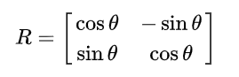
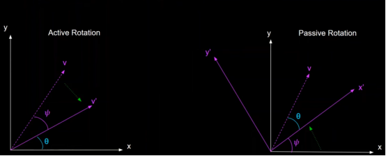

## Rotation Transformation in 3D Space

* Rotation transformation involves rotating points about an axis, which can either pass through the origin or be located arbitrarily in space. This transformation is fundamental in graphics applications, particularly when working with the coordinate axes X, Y, and Z.

### Rotation Matrices

* Rotation is performed by multiplying the point with a rotation matrix. Specific matrices exist for rotations about X, Y, and Z axes, each playing a standard role in graphic transformations.

**Rotation Matrix:**

  

Rotations can also be executed about an arbitrary axis, following these steps:

1. Rotate the arbitrary axis about one of the coordinate axes (e.g., Y) to align it with one of the coordinate planes (e.g., XY).
2. Rotate this axis about the Z-axis to align it with the Y-axis.
3. Perform the required rotation about the Y-axis using the rotation matrix RY.
4. Reverse the steps 2 and 1 to restore the axis to its original alignment.

### Rotation about a Specific Point

Rotation matrices inherently rotate all points about an axis, which can either pass through the origin or be located arbitrarily in space. To rotate about a specific point, a translation operation is necessary. The matrix for rotating about a particular point is given by:

M = T-1RT

Here, T translates the point to the origin, R is the rotation matrix, and T translates the point back to its original location.

#### **Example-**

Let say we want to rotate a point `P = (x, y)` around another point `O = (a, b)`:

#### **1. Translate the Point to the Origin**

Move the point `P` so that the point `O` becomes the origin. You do this by subtracting the coordinates of `O` from `P`:

`P' = (x - a, y - b)`

So, now `P'` is the translated point, with `O` at the origin.

#### **2. Apply the Rotation**

Now that `P'` is at the origin, you can apply a rotation matrix `R` to rotate the point around the origin. For a counterclockwise rotation by an angle `θ`, the rotation matrix `R` is:

  

Apply the matrix to `P'` to get the rotated point:

`P'' = R * P'`

#### **3. Translate the Point Back**

After the rotation, you move the point back to its original location by adding the coordinates of `O` back to `P''`:

`Pfinal = (P''x + a, P''y + b)`

This is how you rotate a point around another point, rather than the origin.

## Frame of Reference

* Understanding the frame of reference is crucial when considering rotations, as all rotations are described relative to a particular frame of reference. For any orthogonal transformation on a body in a coordinate system, there is an inverse transformation that, when applied to the frame of reference, results in the body being at the same coordinates.

### For example:

*   **Object Rotation:** When an object rotates, its position changes relative to a fixed frame of reference, typically the coordinate axes.  
 _Example:_- Rotating a square 45° clockwise about the origin changes its vertex positions relative to the X-Y axes.

*   **Frame of Reference Rotation:** Instead of rotating the object, you can rotate the coordinate axes (the frame of reference) in the opposite direction. 
 Example:- Rotating the coordinate axes 45° counterclockwise while keeping the square fixed gives the same result as rotating the square clockwise.

### Key Concept

* Rotating an object clockwise relative to a fixed frame of reference is mathematically equivalent to rotating the frame of reference counterclockwise while keeping the object stationary. This dual perspective helps in understanding transformations from different viewpoints.

* **Active rotation** refers to rotating the object itself, while **passive rotation** refers to rotating the frame of reference while keeping the object stationary.

 
    
v - original vector, v' - vector after rotation
    
and x,y - original coordinate axes , x', y' - coordinate axes after rotation, ψ - Angle of rotation